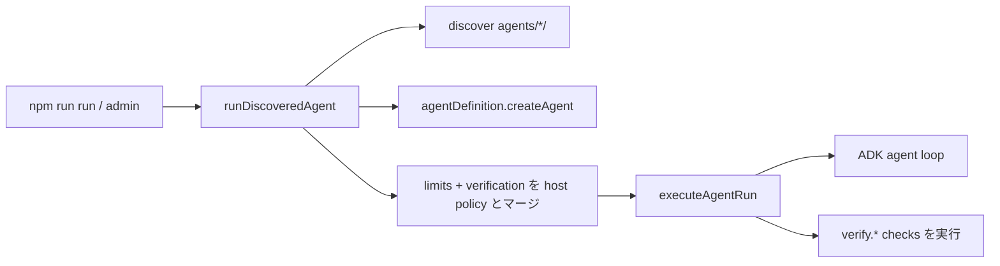

# エージェントパッケージ仕様（実装者向け）

新しいエージェントを追加・改修するときの **正本**。アーキテクチャ全体は [ARCHITECTURE.md](./ARCHITECTURE.md)、レイヤ境界は `.cursor/rules/layer-boundaries.mdc`。

## 一言で

`agents/<id>/` に `agent.ts` を置けば、CLI / admin が自動発見して同じ経路で実行する。`params.yaml` は任意（無ければ既定の単一 `message` フィールド）。`packages/*`・`scripts/`・ルート `package.json` にエージェント固有の分岐を足さない。

```
agents/<id>/
  agent.ts           # export const agentDefinition（必須。limits / verification を内包）
  params.yaml         # 呼出し入力（フォーム / CLI values）。任意
```

ディレクトリ名 = `agentDefinition.id`（`params.yaml` があればその `agentId` も一致必須）。不一致は fail-closed。

`runspec.json` / `evaluation.json` を著者が置く仕組みは廃止された（互換レイヤなし）。過去の実行履歴ディレクトリ（`.runs/runs/...`）には旧形式の同名ファイルが残ることがあるが、リーダーはそれを無視する。

## 実行経路



単一エントリは [`agents/dev-env/run-discovered-agent.ts`](../agents/dev-env/run-discovered-agent.ts) の `runDiscoveredAgent`。CLI（[`scripts/run.ts`](../scripts/run.ts)）も admin もここ経由。内部で `@agent-env/harness` の `executeAgentRun`（`runFromSpec` ではない）を呼ぶ。

host 側の既定 execution policy は [`agents/dev-env/execution-policy.ts`](../agents/dev-env/execution-policy.ts) の `DEFAULT_HOST_EXECUTION_LIMITS`（`maxSteps` / `maxToolCalls` = 200、`maxWallSeconds` = 1800、`maxRepairs` = 3、`maxSubagentDepth` = 3）。`mergeExecutionLimits` が agent の `limits` と host 既定をフィールドごとに **小さい方** へマージする（agent は緩めることができない）。

## 責務の分離

| ファイル | 持つもの | 持たないもの |
|----------|----------|--------------|
| `agent.ts` | ADK グラフ、`limits`、`verification`、ツール配線、`context.secret` / `context.config` / `context.inputs` | モジュール先頭の env bootstrap、固定のユーザー objective |
| `params.yaml`（任意） | フォーム項目・default・`objectiveField` | 実行ポリシー・評価条件（それらは `agent.ts` 側） |

**Build vs Run:** `createAgent(context)` はグラフ構築だけ。ユーザーのメッセージや構造化入力はランタイムが `AgentRunRequest` → ADK `stateDelta` に載せる。並行実行で状態を漏らさないため、可変のワークスペース roots 等は **`createAgent` 内のローカル変数**に閉じる（モジュールグローバル禁止）。

## 1. `agent.ts`

```typescript
import { defineAgent, verify } from '@agent-env/harness';
import { LlmAgent } from '@google/adk';

export const agentDefinition = defineAgent({
  id: 'my-agent',          // === ディレクトリ名
  name: 'My Agent',
  description: '…',
  limits: {
    maxSteps: 20,
    maxToolCalls: 20,
    maxWallSeconds: 300,
    maxRepairs: 1,
  },
  verification: {
    checks: [verify.nonEmpty()],
  },
  createAgent(context) {
    // 秘密・設定は host 注入（packages は process.env を読まない）
    const apiKey = context.secret('TAVILY_API_KEY');
    // 構造化入力でグラフ形状を変える場合のみ context.inputs を参照
    return new LlmAgent({
      name: 'my_agent',
      model: 'cursor:auto',   // provider:model 文字列（ADK LLMRegistry ルーティング）
      instruction: '…',
      // tools: […]
    });
  },
});
```

- `model` は `provider:model` 文字列を `LlmAgent.model` に直接渡すのが標準（例 `cursor:auto` / `gemini:gemini-3.1-pro`）。明示的な `BaseLlm` が要るときだけ `resolveModel({ provider, model })` を使う（`@agent-env/llm`）。**run 単位のモデル上書きはない** — モデルは `agent.ts` が決める
- `limits` は省略可（省略時は host 既定のみ）。指定した値は host 既定より緩めることはできない（`mergeExecutionLimits` が min を取る）
- `verification` は静的な `{ checks: [...] }` でも、`(context) => {...}` 関数（async 可）でもよい。host 側の追加検証（あれば）は agent の checks の後ろに連結される
- env bootstrap（`loadDotEnv` / `bootstrapProvidersFromEnv`）は **書かない**。ホスト（`runDiscoveredAgent` / admin）が行う
- 外部データ源は harness の connector / tool factory を使う（`.cursor/rules/reuse-existing.mdc`）。エージェント内に vendor `fetch` を直書きしない
- 最小例: [`agents/hello/agent.ts`](../agents/hello/agent.ts)

## 2. `params.yaml`（呼出し入力・任意）

admin フォームと CLI の `values` のスキーマ。実行ポリシーではない。省略した場合、discovery は既定の単一 `message`（text, required）フィールドを持つ `AgentParamsSpec` を合成する（`defaultAgentParams`、[`agents/dev-env/catalog.ts`](../agents/dev-env/catalog.ts)）。

```yaml
apiVersion: agent-env/v1
kind: AgentParams
agentId: my-agent
title: My Agent
objectiveField: message   # 省略時 message。fields に存在する id
fields:
  - id: message
    type: text
    label: 初回クエリ
    required: true
    default: "…"
  - id: maxItems
    type: number
    default: 8
    min: 1
    max: 20
  - id: allowWrite
    type: boolean
    default: false
  - id: docs
    type: files
    delivery: content   # path | content（file 既定 path / image 既定 content）
    accept: [.pdf, .md]
```

### values の形

admin `POST { values }` と CLI `--params` は同じフラットオブジェクト:

```json
{
  "message": "…",
  "maxItems": 5,
  "allowWrite": false
}
```

`applyAgentParams` が型変換し、次を作る:

- `objective` … `objectiveField` の値
- `inputs` … その他フィールド（ADK session state / `AgentBuildContext.inputs`）
- `attachments` … `delivery: content` のファイル

### CLI

```bash
# 位置引数 → objectiveField
npm run run -- my-agent "メッセージ"

# values JSON（admin と同形）
npm run run -- my-agent --params ./my-values.json

# ワンショット上書き
npm run run -- my-agent --params ./my-values.json --input maxItems=3 "上書きメッセージ"
```

マージ順（後勝ち）: `params.yaml` default → `--params` → `--input` → 位置メッセージ。

boolean は `true` / `false` / `1` / `0`。files はカンマ区切りパス可。

## 3. `limits`（実行ポリシー）

`AgentExecutionLimits`（`@agent-env/shared`）:

| フィールド | 意味 | host 既定 |
|-----------|------|-----------|
| `maxSteps` | 非 partial エージェントイベントの上限。超過で `FAILED` | 200 |
| `maxToolCalls` | ツール呼び出し数の上限。超過は `BUDGET_EXHAUSTED` | 200 |
| `maxWallSeconds` | 実行時間の上限 | 1800 |
| `maxRepairs` | required 検証失敗時に再試行できる回数（`REPAIRING` → 失敗チェックをフィードバック → 再実行） | 3 |
| `maxSubagentDepth` | `context.buildSubagent` によるネスト深さの上限 | 3 |

agent の `limits` は host 既定より **緩められない**（フィールドごとに `Math.min(host, agent)`）。

### サブエージェント（別の `agentDefinition` を再利用）

**同じ `agents/<id>/agent.ts` が単体実行も親からの呼び出しもできる。** 子グラフをコピーしない。

1. 子を普通のエージェントとして置く（単体: `npm run run -- investigator "..."`）
2. 親は `createSubagentTool(context, 'investigator')` で同じ定義を AgentTool 化

host（`runDiscoveredAgent` / admin）が `context.buildSubagent` を注入する。packages に registry はない。参照: `agents/investigator/`（子）+ `agents/research-desk/`（親）。

```typescript
import { createSubagentTool, defineAgent } from '@agent-env/harness';

async createAgent(context) {
  // Same agentDefinition as standalone `investigator`
  const investigator = await createSubagentTool(context, 'investigator');
  return new LlmAgent({
    name: 'research_desk',
    model: 'cursor:auto',
    instruction: 'Delegate focused questions to investigator, then synthesize.',
    tools: [investigator],
  });
}
```

深さは `limits.maxSubagentDepth`（host と min マージ）。循環依存は fail-closed。下位 API は `context.buildSubagent(id)` + `createTrackedAgentTool`。

## 4. `verification`（成功判定）

成功は agent の完了文ではなく postcondition。`agentDefinition.verification` は `VerificationCheck[]` を持つ `{ checks: [...] }`（`VerificationPlan`）。`@agent-env/harness` の `verify.*` ファクトリで組み立てる:

```typescript
import { verify } from '@agent-env/harness';

verification: {
  checks: [
    verify.artifact({ artifactId: 'report', mediaTypes: ['text/markdown'], minBytes: 100 }),
    verify.nonEmpty({ severity: 'advisory' }),
  ],
},
```

### `verify.*` ファクトリ

| ファクトリ | 見るもの |
|-----------|---------|
| `verify.nonEmpty()` | finalText 非空 |
| `verify.contains({ text })` | finalText の部分文字列 |
| `verify.artifact({ artifactId, mediaTypes, minBytes })` | workspace 内の成果物の存在・サイズ・MIME |
| `verify.document({ sections, artifactId? \| sourcePath? })` | MD/HTML の見出し契約 |
| `verify.jsonSchema({ schemaRef, sourcePath? })` | JSON Schema（成果物 or finalText） |
| `verify.command({ bin, args, expectExitCode? })` | 固定 argv の終了コード（+ 任意の出力部分一致） |
| `verify.custom({ verifierId })` | 実行時に `ExecuteVerificationContext.custom[verifierId]` として注入された関数（SPI） |
| `verify.agent({ graderId })` | 実行時に `ExecuteVerificationContext.agentGraders[graderId]` として注入された別モデル grader（SPI） |

各 check は `severity: 'required' | 'advisory'`（既定 `required`）を持つ。同一 `artifactId` で mediaTypes だけ違う契約（例: `report.md` + `report.pdf`）を並べてよい。

`verify.custom` / `verify.agent` は SPI（実行時にホストが `custom` / `agentGraders` を渡さなければ fail）。エージェント固有のネスト評価は、無理に verification に入れ子にせず `runAgent` + Zod 等で済ませてよい（security-audit 参照）。

### 終了状態（`RunRecord.state`）

| 状態 | 条件 |
|------|------|
| `SUCCEEDED` | required check が 1 つ以上あり、すべて合格 |
| `COMPLETED` | required check が 0 件（advisory のみ、または checks が空）で正常終了。ゲートなしの成功扱い |
| `FAILED` | required check が 1 つ以上失敗（`maxRepairs` 使い切り後）、または budget / maxSteps 超過など |

`SUCCEEDED` と `COMPLETED` はいずれも成功として扱う（`isSuccessfulRunState`、`@agent-env/shared`）。admin UI は `COMPLETED` = Unverified、`SUCCEEDED` = Verified と表示する。

## 作業環境ヘルパー（任意）

実行ハーネス（limits / verification）の内側で使う、Loop / Connection / Data の薄い契約。

```ts
import {
  contextBudgetModelParams,
  createAgentMemoryStore,
  createAgentMemoryTools,
  createContextBuilder,
  createEmitHandoffTool,
  createHandoffArtifact,
  shapeObservation,
} from '@agent-env/harness';
import { evidenceBundleSchema } from '@agent-env/shared';

// Loop: ModelRef.params に context 予算を載せる（OpenAI-compatible tool loop）
const params = contextBudgetModelParams({
  contextWindow: 128_000,
  contextOverflow: 'truncate-then-summarize',
});

// Loop: working context を予算内に組む（full trace とは別）
const ctx = createContextBuilder({ budgetTokens: 4000 })
  .addSection({ kind: 'task', title: 'Task', content: objective })
  .addObservation('Last tool', {
    status: 'ok',
    content: toolResult,
    source: 'tool',
    handle: { uri: 'artifact://tool/1' },
  })
  .build();

// Connection: 型付き handoff
const handoff = createHandoffArtifact({
  fromAgent: 'researcher',
  toAgent: 'writer',
  objective: '…',
  outputSchema: 'artifact://schemas/evidence-bundle-v1',
  payload,
  payloadSchema: evidenceBundleSchema,
});

// Data: agent memory（fixture の createMemoryConnector とは別）
const memory = createAgentMemoryStore();
const memoryTools = createAgentMemoryTools({ store: memory });
```

非目標（まだやらない）: GraphRAG、外部マネージド vector DB 必須化、A2A、学習型 memory policy、全 agent への CodeAct 強制。
ローカル Knowledge / RAG（BM25 + optional embeddings）は実装済み — 下記参照。

## Knowledge / RAG（任意）

Markdown・コード・PDF を差分インデックスし、ハイブリッド検索（BM25 + optional dense + RRF/MMR）で根拠付き回答する。

```ts
import {
  createDeterministicEmbedder,
  createKnowledgeTools,
  createWorkspaceSearchTools,
  createKnowledgeSearchAgentTool,
} from '@agent-env/harness';

const embedder = createDeterministicEmbedder({ dimension: 64 });
// 本番: createOpenaiCompatibleEmbedder / createGeminiEmbedder を注入
const knowledge = createKnowledgeTools({
  collectionId: 'docs',
  indexPath: resolve(repoRoot, '.agent-env/knowledge/docs.sqlite'),
  roots: [resolve(agentDir, 'knowledge')],
  embedder,
});
await knowledge.knowledgeBase.sync();
const live = createWorkspaceSearchTools({ roots: [resolve(agentDir, 'knowledge')] });
const agentic = createKnowledgeSearchAgentTool({
  knowledgeBase: knowledge.knowledgeBase,
  workspaceSearch: live,
  model,
  useLlmAgent: false, // 複雑質問時は true で ADK AgentTool
});
```

- Index: `.agent-env/knowledge/<collection>.sqlite`（gitignore 済み）
- Tools: `knowledge_sync` (T1) / `knowledge_search|get|status` (T0) / live `glob_files|search_text|read_file_range`
- 評価: `verify.custom` / `verify.agent`（retrieval metrics・citation 整合はエージェント固有の grader として登録）
- 確認: `npm run smoke:knowledge` / 例: `npm run run -- knowledge-assistant "..."`
- 後続候補（測定後）: GraphRAG、HyDE、cross-encoder rerank、外部 Qdrant/pgvector（`KnowledgeStore` SPI）

## Python スクリプト環境（任意）

固定パイプライン（YOLO / OpenCV 等）は **AI 生成コードではなく** `agents/<id>/python/` に置き、typed tool で呼ぶ。

```
agents/<id>/python/
  requirements.txt     # ensurePythonEnv が uv venv + uv pip install
  scripts/
    detect.py          # 事前宣言スクリプト（stdout に JSON 推奨）
  .venv/               # gitignore（uv が生成）
```

```ts
import { createPythonScriptTool } from '@agent-env/harness';
import { z } from 'zod';

const runDetect = createPythonScriptTool({
  pythonRoot: resolve(agentDir, 'python'),
  script: 'scripts/detect.py',
  name: 'run_detect',
  riskClass: 'T1',
  parameters: z.object({
    imagePath: z.string(),
    conf: z.number().optional(),
  }),
});
```

- 既定: ツール引数を JSON stdin（`--json-stdin`）で渡し、stdout の JSON をパース
- モデル生成 Pythonが必要なときだけ `createPythonCodeRunnerTool`（T2、`python/.code-exec/`）
- **Python 管理は uv 必須**（`python -m venv` / 生 pip 禁止）。`.cursor/rules/python-uv.mdc`
- 確認: `npm run smoke:python-env` / 例: `npm run run -- python-vision "..."`

確認: `npm run smoke:working-env`

## ワークスペースと履歴

- 実行ごとに `.runs/runs/<agentId>/<stamp>-<runId8>/` が作られる
- `workspace/` の絶対パスは ADK state `runWorkspaceDir`（`RUN_WORKSPACE_STATE_KEY`）に入る
- 成果物を書くツールは `createWorkspaceFsTools` 等の roots にこのパスを含める
- 同ディレクトリに `run.json` / `result.json` / `final.md` / `progress.jsonl` / `verification-plan.json` / `effective-graph.json` / `observed-graph.json` / `intent.json` が残る

## チェックリスト（新規エージェント）

1. [ ] `agents/<id>/agent.ts` を置いた（`params.yaml` は必要なら追加）
2. [ ] `agentDefinition` を export（`rootAgent` ではない）
3. [ ] id が一致（ディレクトリ / `params.yaml` の `agentId`（ある場合） / `definition.id`）
4. [ ] `params.yaml` があるなら `objectiveField` 対象フィールドがある
5. [ ] 実行ポリシーは `agentDefinition.limits`、成功条件は `agentDefinition.verification`（`verify.*`）のみに置いた
6. [ ] モジュールグローバルな可変状態なし（run 単位は `createAgent` 内）
7. [ ] connector 向きの能力をエージェント内に自前実装していない
8. [ ] `packages/*` / `scripts/` / ルート scripts に固有 id を足していない
9. [ ] `npm run smoke:params` / `npm run smoke:runtime` でパース確認

任意: `agents/<id>/package.json` + ルート `tsconfig.json` の project reference、`exec/`（TS）または `python/`（Python）。

## サンプル対応表

| id | 参考ポイント |
|----|----------------|
| `hello` | ContextBuilder + agent memory tools |
| `runspec-demo` | `limits` + guarded tools + typed result handoff + T2 approval |
| `code-exec` | bounded observations + optional CodeAct TS runner |
| `python-vision` | `python/scripts/detect.py`（mock YOLO）→ 判断 |
| `knowledge-assistant` | local hybrid RAG + citations + agentic search |
| `parallel-pipeline` | typed DebateTurn handoffs (PRO/CON → judge) |
| `collector` | connectors 並列収集 + typed EvidenceBundle handoff |
| `deep-research` | typed stage handoffs (scope→plan→ledger→gaps→draft→publish) |
| `security-audit` | findings Zod + handoff digest、ネスト評価は `runAgent`+Zod |
| `local-report` | contextBudgetModelParams + typed evidence handoff |
| `super-debate` | typed PanelTurn handoffs (multi-model → synth) |
| `investigator` | 再利用可能な Web 調査（単体実行可。search/extract → typed brief） |
| `research-desk` | 親: `createSubagentTool(context, 'investigator')` で同じ定義を呼ぶ |

## 関連コード

| 関心事 | 場所 |
|--------|------|
| ディスカバリ | `agents/dev-env/catalog.ts` |
| 単一実行 | `agents/dev-env/run-discovered-agent.ts` |
| host execution policy 既定値 | `agents/dev-env/execution-policy.ts` |
| `defineAgent` / `mergeExecutionLimits` | `packages/harness/src/agent-definition.ts` |
| params 適用 | `packages/harness/src/params/apply-params.ts` |
| 実行オーケストレーション | `packages/harness/src/runtime/run-execution.ts`（`executeAgentRun`） |
| 検証 | `packages/harness/src/verification/{factories,execute}.ts`（`verify.*` / `executeVerificationPlan`） |
| グラフ | `packages/harness/src/runtime/agent-graph.ts`（`describeAgentGraph` / `buildObservedGraph`） |
| スキーマ | `packages/shared/src/{agent-params,agent-run,run-record,verification,working-context,handoff,agent-memory}.ts` |
| Context / handoff / memory | `packages/harness/src/{context,handoff,memory}/` |
| CLI | `scripts/run.ts` |
| Admin | `apps/admin/` |
