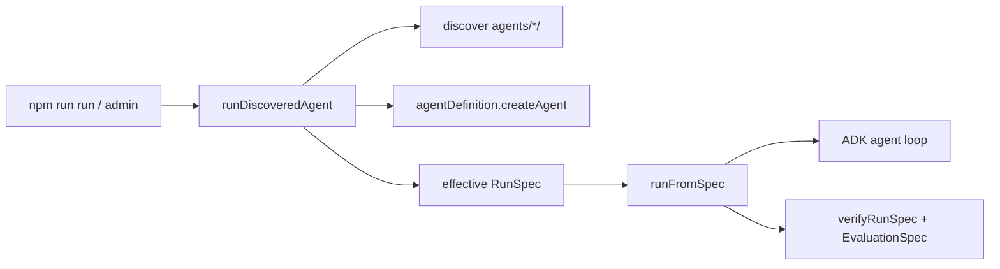

# エージェントパッケージ仕様（実装者向け）

新しいエージェントを追加・改修するときの **正本**。アーキテクチャ全体は [ARCHITECTURE.md](./ARCHITECTURE.md)、レイヤ境界は `.cursor/rules/layer-boundaries.mdc`。

## 一言で

`agents/<id>/` に 4 ファイルを置けば、CLI / admin が自動発見して同じ経路で実行する。`packages/*`・`scripts/`・ルート `package.json` にエージェント固有の分岐を足さない。

```
agents/<id>/
  agent.ts           # export const agentDefinition
  params.yaml        # 呼出し入力（フォーム / CLI values）
  runspec.json       # 実行ポリシー（budget / tools / model / harness）
  evaluation.json    # 成功判定（EvaluationSpec）
```

ディレクトリ名 = `params.yaml` の `agentId` = `agentDefinition.id`。不一致は fail-closed。

## 実行経路



単一エントリは [`agents/dev-env/run-discovered-agent.ts`](../agents/dev-env/run-discovered-agent.ts) の `runDiscoveredAgent`。CLI（[`scripts/run.ts`](../scripts/run.ts)）も admin もここ経由。

## 責務の分離

| ファイル | 持つもの | 持たないもの |
|----------|----------|--------------|
| `agent.ts` | ADK グラフ、ツール配線、`context.secret` / `context.config` / `context.inputs` | モジュール先頭の env bootstrap、固定のユーザー objective |
| `params.yaml` | フォーム項目・default・`objectiveField` | `runMode` / `runspecPath` / 評価条件 |
| `runspec.json` | task / model / tools.allow / budget / harness / `evaluation.ref` | インライン `successCriteria` |
| `evaluation.json` | artifacts / graders / acceptance | 実行ポリシー本体 |

**Build vs Run:** `createAgent(context)` はグラフ構築だけ。ユーザーのメッセージや構造化入力はランタイムが `AgentRunRequest` → effective RunSpec / ADK `stateDelta` に載せる。並行実行で状態を漏らさないため、可変のワークスペース roots 等は **`createAgent` 内のローカル変数**に閉じる（モジュールグローバル禁止）。

## 1. `agent.ts`

```typescript
import { defineAgent, resolveModel, defaultCursorModelRef } from '@agent-env/harness';
import { LlmAgent } from '@google/adk';

export const agentDefinition = defineAgent({
  id: 'my-agent',          // === ディレクトリ名
  name: 'My Agent',
  description: '…',
  createAgent(context) {
    // 秘密・設定は host 注入（packages は process.env を読まない）
    const apiKey = context.secret('TAVILY_API_KEY');
    // 構造化入力でグラフ形状を変える場合のみ context.inputs を参照
    return new LlmAgent({
      name: 'my_agent',
      model: resolveModel(defaultCursorModelRef()),
      instruction: '…',
      // tools: […]
    });
  },
});
```

- env bootstrap（`loadDotEnv` / `bootstrapProvidersFromEnv`）は **書かない**。ホスト（`runDiscoveredAgent` / admin）が行う。
- 外部データ源は harness の connector / tool factory を使う（`.cursor/rules/reuse-existing.mdc`）。エージェント内に vendor `fetch` を直書きしない。
- 最小例: [`agents/hello/agent.ts`](../agents/hello/agent.ts)

## 2. `params.yaml`（呼出し入力）

admin フォームと CLI の `values` のスキーマ。実行ポリシーではない。

```yaml
apiVersion: agent-env/v1
kind: AgentParams
agentId: my-agent
title: My Agent
objectiveField: message   # 省略時 message。fields に存在する id
fields:
  - id: message
    type: text
    label: 初回クエリ
    required: true
    default: "…"
  - id: maxItems
    type: number
    default: 8
    min: 1
    max: 20
  - id: allowWrite
    type: boolean
    default: false
  - id: docs
    type: files
    delivery: content   # path | content（file 既定 path / image 既定 content）
    accept: [.pdf, .md]
```

### values の形

admin `POST { values }` と CLI `--params` は同じフラットオブジェクト:

```json
{
  "message": "…",
  "maxItems": 5,
  "allowWrite": false
}
```

`applyAgentParams` が型変換し、次を作る:

- `objective` … `objectiveField` の値
- `inputs` … その他フィールド（ADK session state / RunSpec `task.inputs`）
- `attachments` … `delivery: content` のファイル

### CLI

```bash
# 位置引数 → objectiveField
npm run run -- my-agent "メッセージ"

# values JSON（admin と同形）
npm run run -- my-agent --params ./my-values.json

# ワンショット上書き
npm run run -- my-agent --params ./my-values.json --input maxItems=3 "上書きメッセージ"
```

マージ順（後勝ち）: `params.yaml` default → `--params` → `--input` → 位置メッセージ。

boolean は `true` / `false` / `1` / `0`。files はカンマ区切りパス可。

## 3. `runspec.json`（実行ポリシー）

テンプレート。1 attempt の有効 RunSpec はホストが objective / inputs / model を merge したコピー（ディスクは書き換えない）。履歴ディレクトリに有効版を保存する。

必須に近い項目:

- `spec.task` … `taskId` / `revision` / `objective`（CLI で上書きされる）
- `spec.model.primary`（任意で `allowed`）
- `spec.tools.allow` … fail-closed。空なら実質ツール無し
- `spec.budget` … `maxToolCalls` / `maxWallSeconds` 等
- `spec.harness` … `maxSteps` / `maxRepairs` 等
- `spec.evaluation.ref` … 通常 `"./evaluation.json"`

インラインの成功条件（旧 `successCriteria`）は置かない。

例: [`agents/runspec-demo/runspec.json`](../agents/runspec-demo/runspec.json)

## 4. `evaluation.json`（成功判定）

成功は agent の完了文ではなく postcondition。

```json
{
  "apiVersion": "agent.platform/v1",
  "kind": "EvaluationSpec",
  "metadata": { "id": "my-agent", "version": "1" },
  "artifacts": [
    {
      "id": "report",
      "mediaTypes": ["text/markdown"],
      "required": true,
      "minBytes": 100
    }
  ],
  "graders": [
    {
      "id": "artifacts",
      "kind": "deterministic",
      "ref": "grader://artifact-contract/v1",
      "config": {}
    },
    {
      "id": "output",
      "kind": "deterministic",
      "ref": "grader://non-empty/v1",
      "config": {}
    }
  ],
  "acceptance": {
    "all": [
      { "id": "files", "grader": "artifacts", "assertion": "present" },
      { "id": "text", "grader": "output", "assertion": "non-empty" }
    ]
  }
}
```

### deterministic grader（主な ref）

| ref | 用途 |
|-----|------|
| `grader://non-empty/v1` | finalText 非空 |
| `grader://contains/v1` | 部分文字列 |
| `grader://artifact-contract/v1` | `artifacts[]` の存在・サイズ・MIME |
| `grader://document-contract/v1` | MD/HTML 見出し（`config.artifact` / `sections`） |
| `grader://json-schema/v1` | JSON Schema（成果物 or finalText） |
| `grader://command/v1` | 固定 argv の終了コード |

同一 `artifacts[].id` で mediaTypes だけ違う契約（例: `report.md` + `report.pdf`）を並べてよい。contract ごとに照合する。document grader は markdown/html を優先する。

`kind: agent` / `kind: external` は SPI（ホスト未設定なら fail）。エージェント固有のネスト評価は、無理に RunSpec を入れ子にせず `runAgent` + Zod 等で済ませてよい（security-audit 参照）。

## 作業環境ヘルパー（任意）

実行ハーネス（RunSpec / budget / verifier）の内側で使う、Loop / Connection / Data の薄い契約。

```ts
import {
  contextBudgetModelParams,
  createAgentMemoryStore,
  createAgentMemoryTools,
  createContextBuilder,
  createEmitHandoffTool,
  createHandoffArtifact,
  shapeObservation,
} from '@agent-env/harness';
import { evidenceBundleSchema } from '@agent-env/shared';

// Loop: ModelRef.params に context 予算を載せる（OpenAI-compatible tool loop）
const params = contextBudgetModelParams({
  contextWindow: 128_000,
  contextOverflow: 'truncate-then-summarize',
});

// Loop: working context を予算内に組む（full trace とは別）
const ctx = createContextBuilder({ budgetTokens: 4000 })
  .addSection({ kind: 'task', title: 'Task', content: objective })
  .addObservation('Last tool', {
    status: 'ok',
    content: toolResult,
    source: 'tool',
    handle: { uri: 'artifact://tool/1' },
  })
  .build();

// Connection: 型付き handoff
const handoff = createHandoffArtifact({
  fromAgent: 'researcher',
  toAgent: 'writer',
  objective: '…',
  outputSchema: 'artifact://schemas/evidence-bundle-v1',
  payload,
  payloadSchema: evidenceBundleSchema,
});

// Data: agent memory（fixture の createMemoryConnector とは別）
const memory = createAgentMemoryStore();
const memoryTools = createAgentMemoryTools({ store: memory });
```

非目標（まだやらない）: GraphRAG、外部 vector DB、A2A、学習型 memory policy、全 agent への CodeAct 強制。

確認: `npm run smoke:working-env`

## ワークスペースと履歴

- 実行ごとに `.runs/runs/<agentId>/<stamp>-<runId8>/` が作られる
- `workspace/` の絶対パスは ADK state `runWorkspaceDir`（`RUN_WORKSPACE_STATE_KEY`）に入る
- 成果物を書くツールは `createWorkspaceFsTools` 等の roots にこのパスを含める
- 同ディレクトリに有効 `runspec.json` / `evaluation.json` / `progress.jsonl` / `result.json` / `final.md` が残る

## チェックリスト（新規エージェント）

1. [ ] `agents/<id>/` に 4 必須ファイル
2. [ ] `agentDefinition` を export（`rootAgent` ではない）
3. [ ] id 三者が一致（ディレクトリ / params.agentId / definition.id）
4. [ ] `params.yaml` に `objectiveField` 対象フィールドがある
5. [ ] `runspec.json` の `evaluation.ref` が `./evaluation.json`
6. [ ] 成功条件は EvaluationSpec のみ
7. [ ] モジュールグローバルな可変状態なし（run 単位は `createAgent` 内）
8. [ ] connector 向きの能力をエージェント内に自前実装していない
9. [ ] `packages/*` / `scripts/` / ルート scripts に固有 id を足していない
10. [ ] `npm run smoke:params` / `npm run smoke:runtime` でパース確認

任意: `agents/<id>/package.json` + ルート `tsconfig.json` の project reference、`exec/`（code-exec 系）。

## サンプル対応表

| id | 参考ポイント |
|----|----------------|
| `hello` | ContextBuilder + agent memory tools |
| `runspec-demo` | bounded observations + typed result handoff + T2 approval |
| `code-exec` | bounded observations + optional CodeAct TS runner |
| `parallel-pipeline` | typed DebateTurn handoffs (PRO/CON → judge) |
| `collector` | connectors 並列収集 + typed EvidenceBundle handoff |
| `deep-research` | typed stage handoffs (scope→plan→ledger→gaps→draft→publish) |
| `security-audit` | findings Zod + handoff digest、ネスト評価は `runAgent`+Zod |
| `local-report` | contextBudgetModelParams + typed evidence handoff |
| `super-debate` | typed PanelTurn handoffs (multi-model → synth) |

## 関連コード

| 関心事 | 場所 |
|--------|------|
| ディスカバリ | `agents/dev-env/catalog.ts` |
| 単一実行 | `agents/dev-env/run-discovered-agent.ts` |
| `defineAgent` | `packages/harness/src/agent-definition.ts` |
| params 適用 | `packages/harness/src/params/apply-params.ts` |
| RunSpec 実行 | `packages/harness/src/runtime/run-from-spec.ts` |
| 検証 | `packages/harness/src/runtime/verifier.ts` |
| スキーマ | `packages/shared/src/{agent-params,agent-run,run-spec,evaluation-spec,working-context,handoff,agent-memory}.ts` |
| Context / handoff / memory | `packages/harness/src/{context,handoff,memory}/` |
| CLI | `scripts/run.ts` |
| Admin | `apps/admin/` |
