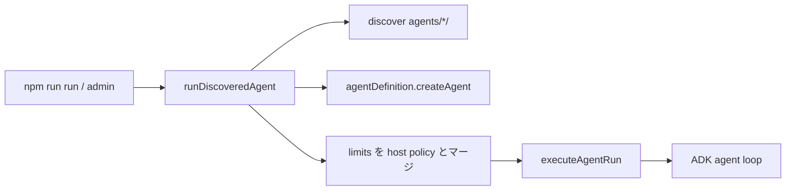

# agent-env アーキテクチャ（研究レポート対応）

参照研究: [docs/research/2026-07-23-llm-agent-execution-harness.md](./research/2026-07-23-llm-agent-execution-harness.md)

**エージェントを追加・改修する人向けのパッケージ規約:** [AGENT_PACKAGE.md](./AGENT_PACKAGE.md)

本リポジトリは「巨大 multi-agent framework」ではなく、研究が推奨する **五つの plane** を薄い TypeScript 契約として段階導入する。

## 五 plane とパッケージ対応

| Plane | 研究上の責務 | 本リポの置き場（現状） |
|-------|--------------|------------------------|
| Specification | エージェントの実行ポリシー | `agents/<id>/agent.ts` の `agentDefinition.limits`（`@agent-env/shared` の `AgentExecutionLimits`） |
| Control | state machine、budget、orchestrator | `packages/harness/src/runtime/`（`executeAgentRun`） |
| Execution | model / typed tool gateway | `@agent-env/llm` + `createGuardedTool` + ADK tools |
| State & evidence | append-only events、artifact | `InMemoryEventStore`（実行中エビデンス）+ **file-backed run history**（`.runs/runs/<agentId>/<stamp>-<runId8>/`：progress.jsonl / result / final.md / workspace） |

実行基盤の五 plane に加え、作業環境（Loop / Connection / Data）の薄い契約も `packages/harness` に段階導入する。

| Working plane | 責務 | 本リポの置き場 |
|---------------|------|----------------|
| Loop | working context 組立・bounded observation | `packages/harness/src/context/`（`createContextBuilder` / `shapeObservation` / `contextBudgetModelParams`） |
| Connection | 型付き handoff | `packages/shared` の `handoffArtifactSchema` + `packages/harness/src/handoff/` |
| Data | agent memory（extract→validate→accept） | `packages/harness/src/memory/`（fixture 用 `createMemoryConnector` とは別） |

オーケストレーションの workflow DSL は Google ADK（Sequential / Parallel / Loop）を継続利用する。Cursor SDK 等は LLM provider アダプタであり、control plane ではない。

ADK FunctionTools の実行経路は provider により 2 系統ある:

- **Gemini**: `createAdkLlm` による ADK ネイティブ function calling（tool ループは ADK 側）。
- **Cursor（既定）**: `ProviderBackedLlm` が `toolsDict` を JSON Schema + execute 関数に変換し、Cursor SDK の `local.customTools`（in-process MCP サーバ "custom-user-tools"）へブリッジする。tool ループは Cursor エージェント側で回り、`createGuardedTool` の T0–T3 ガード（approve / policy_denied）はプロセス内 execute でそのまま効く。

## エージェント定義の契約（Specification plane）

`agents/<id>/agent.ts` が `export const agentDefinition = defineAgent({ id, name, description, limits?, createAgent })` を持つのが唯一の必須ファイル。`params.yaml` は任意（無ければ discovery が既定の単一 `message` フィールドを合成する）。

- **`limits`**（`Partial<AgentExecutionLimits>`）: `maxSteps` / `maxToolCalls` / `maxWallSeconds` / `maxSubagentDepth`。host 既定（`agents/dev-env/execution-policy.ts` の `DEFAULT_HOST_EXECUTION_LIMITS`: steps/tools 2000・wall 7200s・subagentDepth 3）と `mergeExecutionLimits` でフィールドごとに **min** マージされる。agent は host より緩められない
- **モデル**: `provider:model` 文字列（例 `cursor:auto` / `gemini:gemini-3.1-pro`）を ADK `LlmAgent.model` に渡すだけで ADK の LLMRegistry ルーティングに乗る。明示的な `BaseLlm` が要る場合のみ `resolveModel({ provider, model })`（`@agent-env/llm`）。**run 単位のモデル上書きはない**

安全境界は `agentDefinition.limits`（host 既定との min マージ、agent 自身は緩められない）と `createGuardedTool` の T0–T3 fail-closed ガードが担う。

## 実行オーケストレーション（Control plane）



`executeAgentRun`（`packages/harness/src/runtime/run-execution.ts`）が state machine（`QUEUED → PROVISIONING → RUNNING → COMPLETED|FAILED|...`）・budget enforcement・tool gateway をまとめて担う。単一エントリは [`agents/dev-env/run-discovered-agent.ts`](../agents/dev-env/run-discovered-agent.ts) の `runDiscoveredAgent`。CLI（[`scripts/run.ts`](../scripts/run.ts)）も admin もここ経由。定義は builtin `agents/<id>/` と `plugins/<pack>/<id>/` から discovery される（実行の主体は常にホスト）。

### 終了状態

| 状態 | 条件 |
|------|------|
| `COMPLETED` | エージェントが正常終了（budget / maxSteps / policy で落ちていない） |
| `FAILED` | エージェントエラー、maxSteps 超過など |
| `BUDGET_EXHAUSTED` | tool / wall budget 超過 |

`COMPLETED` のみ `isSuccessfulRunState`（`@agent-env/shared`）。

### グラフ（effective / observed）

- `describeAgentGraph(agent, { agentId })` — `createAgent` が返した ADK ツリーから **effective graph**（宣言された構造・モデル・ツール）を静的に構築。`assertGraphModelsResolvable` で未登録 provider を実行前に検出
- `buildObservedGraph(effectiveGraph, events)` — 実際に使われたモデル・辿られたノードから **observed graph** を合成（`RunRecord.modelsUsed` を反映）
- エッジ種別の要点: `next`（順次）/ `parallel`（分岐）/ **`join`**（Parallel 後の session・outputKey 合流）/ **`handoff`**（`createEmitHandoffTool` の型付き引き渡し）/ **`reads`**（LLM → `datasource` ノード）。コネクタは LLM と別ノード（`kind: datasource`）として描画する。admin グラフは top→bottom 固定
- `createSubagentTool` / `createTrackedAgentTool`（`packages/harness/src/tools/tracked-agent-tool.ts`）— 別の発見済み `agentDefinition` を AgentTool として再利用（単体実行と同じ `agents/<id>/agent.ts`）。ADK は子を private に持つため tracked ラップでグラフ検査用の参照を残す
- `createReviewLoopAgent`（`packages/harness/src/agents/review-loop-agent.ts`）— outer の budget / abort / tool approval を共有するレビュー往復ループ（`runAgent()` を入れ子にしない）
- 実行時に `effective-graph.json` / `observed-graph.json` が run history に保存される

## Phase ロードマップ（研究 §9 の圧縮）

### Phase A（実装済み骨格）— 測れる一実行

- [x] `AgentExecutionLimits`（Zod, `@agent-env/shared`）
- [x] Run state machine（遷移検証）
- [x] Append-only event log（in-memory 実行中エビデンス + file-backed `progress.jsonl` via `createRunHistoryStore`）
- [x] Durable per-run history（CLI / admin 共通: `run.json` / `result.json` / `final.md` / `workspace/`）
- [x] Hard budget（tool / wall / tokens / cost）
- [x] Budget をツール gateway で enforce（`maxToolCalls` 超過は呼び出し拒否 → `BUDGET_EXHAUSTED`）
- [x] Tool risk T0–T3 + fail-closed T2/T3（`createGuardedTool` + 実行単位 `toolApproval`: deny / auto / interactive）
- [x] `limits.maxSteps`（非 partial エージェントイベントを step として計数、超過で中断 → `FAILED`）
- [x] AI 生成 TS 実行: `createTsCodeRunnerTool` + エージェント単位 `exec/` npm 環境（`ensureExecEnv`）
- [x] エージェント局所 Python: **uv** 管理の `ensurePythonEnv` + `createPythonScriptTool`（事前宣言 scripts）+ `createPythonCodeRunnerTool`（生成コード T2）
- [x] サンプル: `agents/harness-demo` + `npm run run -- harness-demo`
- [x] サンプル: `agents/code-exec`（固定処理は FunctionTool、生成 TS は `exec/`）
- [x] サンプル: `plugins/personal/python-vision`（`python/scripts/detect.py` mock YOLO → 判断）
- [x] サンプル: `plugins/personal/knowledge-assistant`（local hybrid RAG + citations）

### Phase W（作業環境の骨格）— Loop / Connection / Data

- [x] `createContextBuilder` — instruction/task/plan/memory/observation/information を token 予算内に組む（full trace と分離）
- [x] `shapeObservation` — `ok | error | empty_success` + 上限超過時 handle
- [x] `contextBudgetModelParams` — provider 共通の context-window ノブ（現状 OpenAI-compatible tool loop が消費）
- [x] Typed handoff — digest + schema/宛先検証（`createHandoffArtifact` / `acceptHandoffArtifact` / `createEmitHandoffTool`）
- [x] 参照実装: `collector`（EvidenceBundle handoff）、`security-audit`（findings → handoff digest）
- [x] Agent memory store — propose→validate→accept + ADD/UPDATE/DELETE/NOOP（`createAgentMemoryStore` / `createAgentMemoryTools`）
- [x] Knowledge / RAG — local hybrid index（BM25 + optional embeddings + RRF/MMR）、差分 sync、citation、bounded agentic search（`packages/harness/src/knowledge/`）
- [ ] GraphRAG / 外部 vector DB / A2A / 学習型 memory policy（意図的に後回し。KnowledgeStore SPI で外部 DB へ差し替え可能）

### データソース収集オーケストレーション（優先プロダクト方向）

スケジューラ（KV / 高並列 serving）は本リポの主眼にしない。代わりに **複数データソースへ接続して情報をかき集め、1 つの成果物に合成する** 経路を厚くする。

- [x] Connector 契約（`DataSourceConnector` + risk-aware tool）
- [x] Connector registry / demo fixtures（KB / CRM / status）
- [x] 簡単追加: `createSimpleHttpJsonConnector` / `createHttpJsonConnector`
- [x] GitHub: `createGithubGhConnector`（`gh` CLI・認証は gh 側）
- [x] Web 検索: `createWebSearchConnector`（Tavily / Brave・**鍵は呼び出し側注入**）
- [x] arXiv: `createArxivConnector`（公開 Atom API・鍵不要）
- [x] X 検索: `createGrokBuildXSearchConnector`（Grok Build headless `grok -p`）
- [x] `registerConnectors({ demo, arxiv, githubGh, grokBuildX, http, webSearch })`（env 自動読みなし）
- [x] `agents/collector`: Parallel fan-out → synthesizer（サンプル側で配線）

```bash
npm run smoke:connectors
npm run smoke:connectors:http
npm run run -- collector "…"
```

| ファクトリ | 用途 |
|------------|------|
| `createMemoryConnector` | フィクスチャ / ローカル配列 |
| `createSimpleHttpJsonConnector` | REST JSON（最速追加） |
| `createHttpJsonConnector` | リクエスト/マッピング完全制御 |
| `createGithubGhConnector` | `gh search issues/prs` |
| `createWebSearchConnector` | 公開 Web（Tavily / Brave） |
| `createArxivConnector` | arXiv プレプリント（Atom API） |
| `createGrokBuildXSearchConnector` | X posts（Grok Build CLI） |
| `createKnowledgeConnector` | local KnowledgeBase → EvidenceBundle |
| `createKnowledgeTools` / `createKnowledgeBase` | hybrid RAG sync/search（BM25+vector） |
| `createWorkspaceSearchTools` | glob / text search / ranged read |

`@agent-env/llm` / `@agent-env/harness` は env 名を知らない。`apiKey` / `repo` / `headers` 等は **アプリ側が注入**する。
このリポの env 配線は `agents/dev-env/`（`@agent-env/repo-env`）のみ。`packages/*` には置かない。

未実装（意図的に後回し）:

- サンドボックスの network / egress ポリシー enforce — sandbox が前提のため宣言のみ
- infra retry 系（provisioning / checkpoint 失敗時の自動再試行）— 対応する provisioning / checkpoint 基盤がまだ無い
- 実 Docker/microVM sandbox（現状の code-exec は process jail: timeout / path / output cap / scrubbed env）
- exactly-once delivery / 分散 durable event store（admin Control Plane の SQLite queue は単一プロセス向け）
- Crab/DeltaBox 級 checkpoint
- workflow-aware KV scheduler（不要寄り・本プロダクトでは非優先）
- NLAH 自然言語 harness policy 実行器

## Admin Control Plane（ホスト側）

`apps/admin` は Jenkins 風の **ローカル Control Plane**。実行五 plane は再利用し、起動制御だけをホストが持つ。

| 関心 | 置き場 |
|------|--------|
| Durable job queue + worker slots (`ADMIN_MAX_SLOTS`) | `.runs/control/control.sqlite` + `apps/admin/server/control/` |
| Schedules (cron) / inbound webhooks | 同上 |
| Basic Auth（任意） | `ADMIN_BASIC_USER` / `ADMIN_BASIC_PASSWORD` |
| Live SSE / T2 承認 | 既存 `AdminRunStore`（プロセス内） |
| Build history / artifacts | 既存 `.runs/runs/<agentId>/...` |

ジョブ定義の SoT は引き続き `agents/<id>/`。Control Plane に固有 agent id を焼かない。詳細 API は [apps/README.md](../apps/README.md)。

## 最重要の設計判断（研究 §12.2）

1. 管理単位は model request ではなく **run**
2. agent policy と execution mechanism を分離
3. conversation と environment state を混同しない
4. tool は function list ではなく **authority boundary**
5. 成功は agent の完了文ではなく **postcondition（verifier）**
6. model × harness × environment × grader を独立 version
7. multi-agent / memory / tree search は計測後

## 使い方

```bash
# オフライン契約テスト
npm run smoke
npm run smoke:params   # AgentParams YAML（全ディスカバリ）

# 汎用 CLI（エージェント増えても script は増やさない）
npm run run -- <agent-id> "メッセージ"

# 管理画面（Control Plane: queue / schedules / webhooks）
npm run admin
```

```ts
import { defineAgent, executeAgentRun } from '@agent-env/harness';

export const agentDefinition = defineAgent({
  id: 'demo',
  name: 'Demo',
  description: '…',
  limits: { maxSteps: 20, maxToolCalls: 20, maxWallSeconds: 300 },
  createAgent(_ctx) {
    return /* LlmAgent / SequentialAgent … */;
  },
});

const result = await executeAgentRun({
  agent: await agentDefinition.createAgent({
    repoRoot,
    config: (name) => process.env[name],
    secret: (name) => process.env[name],
  }),
  agentId: agentDefinition.id,
  objective: '…',
  inputs: {},
  limits: mergeExecutionLimits(hostLimits, agentDefinition.limits),
});
```

## AgentParams YAML + admin

エージェントの**呼出し入力**は任意の `agents/<id>/params.yaml` で型付き定義する（スキーマ型だけ `@agent-env/shared`）。無ければ discovery が既定の単一 `message` フィールドを合成する。実行ポリシーは `agent.ts` の `agentDefinition.limits`。

| 層 | 役割 |
|----|------|
| `agents/<id>/` | `agent.ts`（`agentDefinition`。`limits` を内包）+ 任意 `params.yaml` |
| `@agent-env/repo-env` `discoverAgents` / `runDiscoveredAgent` | スキャンと単一実行経路 |
| `packages/*` | 汎用 loader / `executeAgentRun` / `AgentProgressEvent`（エージェント非依存） |
| `scripts/` / `apps/admin` | 汎用エントリ（argv / ディスカバリ駆動。固有 default id なし） |

**エージェント追加時:** `agents/<id>/agent.ts` を置くだけ。`packages/*`・ルート `package.json` は更新しない。

`params.yaml`:

- `objectiveField`（既定 `message`）→ フォーム値から `AgentRunRequest` の `objective` へ
- その他フィールド → `inputs`（構造化入力。`AgentBuildContext.inputs` / ADK session state）または `attachments` / `metadata`
- 実行は常に discovery 経由（`runDiscoveredAgent`）

ファイル系フィールドの `delivery`（エージェント定義が決める）:

- `path` → パス文字列として処理（file/files の既定）
- `content` → LLM ユーザー入力へ添付（image/images の既定）

管理 UI はパス手入力とファイル選択ダイアログの両方を提供し、選択時は `.agent-env/uploads/` へ保存して相対パスを返す。

### provider ごとの対応メディア

`delivery: content` の添付は provider が実際に送れる MIME だけを通す。各アダプタは `LlmProvider.media`（`ProviderMediaSupport`）で対応 MIME と上限バイト数を明示する。

| provider | image | audio | video | document(pdf) | text |
|---|---|---|---|---|---|
| gemini | png/jpeg/webp/gif/heic/heif | wav/mp3/aiff/aac/ogg/flac | mp4/mpeg/mov/avi/flv/webm/wmv/3gpp | ○ | ○ |
| openai | png/jpeg/webp/gif | wav/mp3（audio 対応モデルのみ） | — | ○ | — |
| openrouter | 既定は画像のみ（`media` で上書き可。背後モデル依存） | — | — | — | — |
| anthropic | jpeg/png/gif/webp | — | — | ○ | — |
| cursor | png/jpeg/webp/gif | — | — | — | — |
| openai-compatible | 既定は画像のみ（`media` オプションで上書き / `false` で無効） | — | — | — | — |

- 変換は各アダプタが担当（Gemini: `inlineData`、OpenAI: `image_url`/`input_audio`/`file`、Anthropic: `image`/`document` ブロック、Cursor: `SDKUserMessage.images`）
- 非対応 MIME・サイズ超過は `UnsupportedMediaError` で停止する（黙って落とさない）。`runAgent` は実行開始時にも事前チェックし、エラーにファイルパスを含める
- 一覧は `GET /api/providers`（admin）と `npm run smoke:media` で確認できる

#### テキスト化フォールバック（provider 非対応時）

`delivery: content` の PDF / テキスト系ファイルは、実行する provider がその MIME をネイティブ対応していない場合、`runAgent` が自動でテキスト抽出してユーザー turn のテキストパートに差し込む（バイト添付からは外す）。これで Cursor のような画像のみの provider でも PDF / Markdown / テキストをアップロードして使える。

- 実装: `prepareAttachmentsForProvider`（`packages/harness/src/attachments/`）が `providerSupportsMime` で振り分ける
  - ネイティブ対応（または未登録 provider）→ 従来どおりバイト添付
  - 非対応かつ抽出可能（`isTranscribableMime`）→ テキスト抽出してテキストパート化
  - 非対応かつ抽出不能（画像 / 音声 / 動画）→ バイト添付のまま残し `UnsupportedMediaError` で停止（fail fast）
- 抽出: PDF は `unpdf`（動的 import）、それ以外は UTF-8 読み。抽出失敗は明示エラー
- 対象 MIME: `text/*` + `application/json`、`application/pdf`、および `application/xml` / `application/yaml` 等の text 系 application 型
- 上限: 既定で 1 ファイル 120,000 文字・合計 400,000 文字。超過は末尾に `[truncated: N chars omitted]` を付けて切り詰め
- テキストパート体裁: `[attachment: <name> (<mime>, field=<id>, <pages> pages, text-extracted[, truncated])]` に続けて本文
- progress: 添付イベントの `payload.transcripts`（path / mimeType / chars / truncated / pages）に記録され、admin SSE / `progress.jsonl` に乗る
- 確認: `npm run smoke:attachments`

### リアルタイム進捗と run 履歴

- ハーネス: `runAgent` / `executeAgentRun` の `onProgress` が正規化済み `AgentProgressEvent` を連番付きで通知
- admin: `POST /api/agents/:id/runs` → 即 `runId`、`GET /api/runs/:runId/events` が SSE（ライブはプロセス内。再接続リプレイも同一プロセス内）
- **永続履歴**（CLI / admin 共通）: `createRunHistoryStore` が `.runs/runs/<agentId>/<stamp>-<runId8>/` に `progress.jsonl` / `result.json` / `final.md` / `workspace/` を書く。エージェント定義の変更は不要。`GET /api/runs` はメモリ + ディスクをマージ
- `progress.jsonl` はマイルストーンのみ（`run.*` / 非 partial の `agent.event`）。ストリーム中の `partial` チャンクはライブ SSE 専用でディスクには書かない（累積テキストの全履歴は不要）
- ワークスペース絶対パスは `stateDelta.runWorkspaceDir`（`RUN_WORKSPACE_STATE_KEY`）として注入。エージェントが `createWorkspaceFsTools` / `createHttpDownloadTool` / `createMarkdownPdfTool` の roots に含めるかは任意
- **成果物 API**（admin）: `GET /api/runs/:runId/files` で履歴ディレクトリ配下を一覧、`GET /api/runs/:runId/files/*` で path-jail 付き配信（`?download=1` で attachment）。UI は MD/画像プレビューと DL リンクを表示
- **グラフ API**（admin）: `POST /api/agents/:id/graph` がフォーム値を適用して `describeAgentGraph` を実行なしで返す（Preview）。run 完了後は `GET /api/runs/:runId` の `effectiveGraph` / `observedGraph` で比較できる

詳細: [apps/README.md](../apps/README.md)

## 作らないもの（研究 §1.4）

自由 spawn する swarm、全 tool/secret 共有、無制限 shell、conversation だけの「checkpoint」、公開 benchmark 単一最適化。
